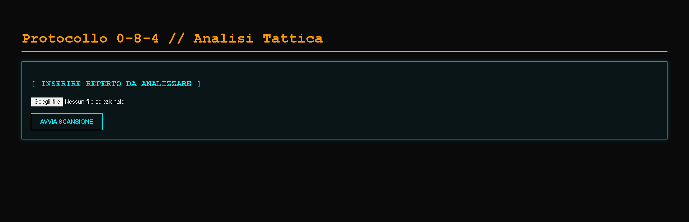
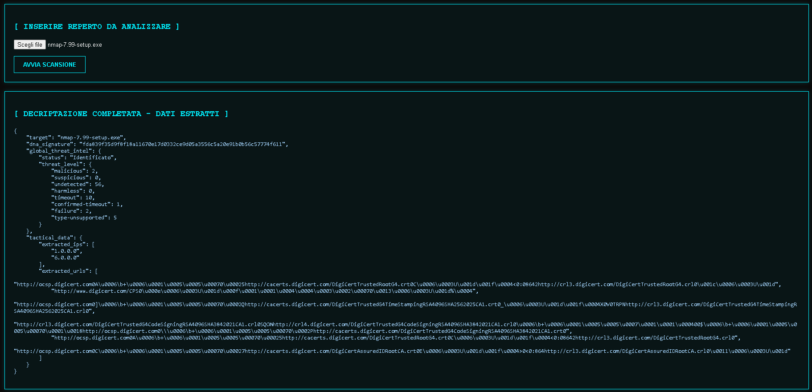

<h1 align="center" style="color: #00FF00;">>> MODULO // S.H.I.E.L.D._SANDBOX 🛡️</h1>

<p align="center">
  <i>Motore di analisi tattica automatizzata per artefatti digitali (0-8-4) e Threat Intelligence, con isolamento Docker.</i>
</p>

---

## ⚙️ ARCHITETTURA DEL SISTEMA
Ho sviluppato questo modulo come ambiente sicuro (Sandbox) per analizzare file sospetti,eseguibili o potenziali malware (Zero-Day) in isolamento, automatizzando le fasi di reverse engineering statico e triage.

* **Estrazione DNA (Hashing)**: Calcola l'impronta crittografica SHA256 del reperto leggendo direttamente i flussi di byte.
* **Threat Intelligence Globale**: Interrogazione asincrona all'API v3 di VirusTotal per verificare i tassi di rilevamento mondiali degli antivirus.
* **Estrazione IoC (Indicatori di Compromissione)**: Motore Regex che scansiona i binari per individuare indirizzi IPv4, URL e server C&C (Command & Control) offuscati nel codice.
* **Interfaccia Olografica**: Frontend in stile terminale sci-fi interattivo, alimentato e servito da un backend ultra-veloce scritto in **FastAPI**.
* **Protocollo di Contenimento**: L'intero sistema è incapsulato in un ambiente **Docker**. I file caricati vengono salvati in una "quarantine zone" e autodistrutti immediatamente dopo l'analisi.

## 📸 INTERCETTAZIONI VISIVE

| Terminale in Ascolto | Estrazione Dati Tattici |
| :---: | :---: |
|  |  |

---

## 🚀 PROTOCOLLO DI ESECUZIONE

Per eseguire questo modulo, è strettamente necessario utilizzare l'infrastruttura **Docker** fornita per garantire l'isolamento del tuo sistema host da eventuali minacce.

```bash
# 1. Configura le chiavi di accesso (Il Vault)
# Crea un file .env nella root del progetto e inserisci la tua chiave VirusTotal
echo "VIRUSTOTAL_API_KEY=la_tua_chiave_api_qui" > .env

# 2. Avvia la Stanza di Contenimento in background
docker-compose up --build -d

# 3. Accedi al Terminale Olografico per avviare le scansioni
# Apri il tuo browser all'indirizzo: http://localhost:8000/ui
```
> **[ OVERRIDE MANUALE ]**: Usa il comando `docker-compose down` per killare l'infrastruttura, spegnere i server web e distruggere in sicurezza i container isolati.

---

<div align="center">
  <p style="color: #444;"><i>// Sviluppato e manutenuto da Andrea Ragucci</i></p>
  <a href="../README.md"></a>
</div>