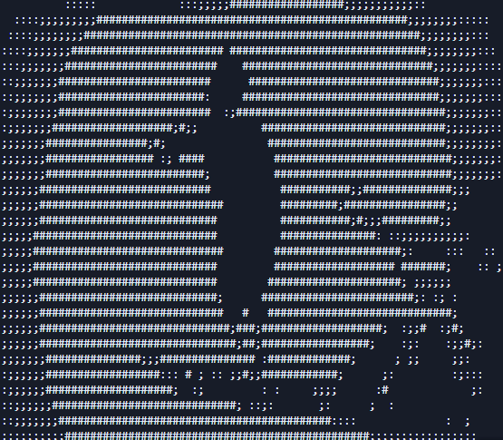
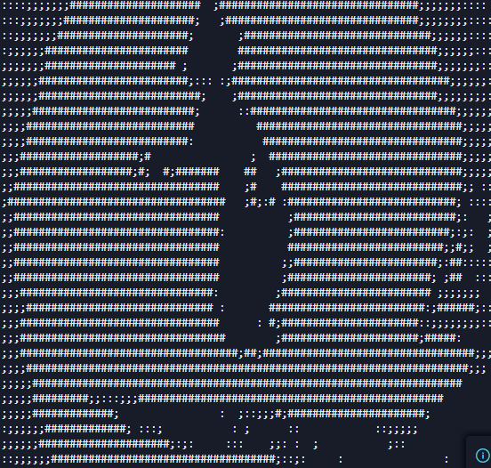

<h1 align="center" style="color: #00FF00;">>> MODULO // ASCII_VIDEO_PLAYER 🎞️</h1>

<p align="center">
  <i>Script proprietario di conversione in tempo reale da flussi video standard a matrici di testo ASCII, renderizzate nativamente su terminale.</i>
</p>

---

## ⚙️ ARCHITETTURA DEL SISTEMA
Ho sviluppato questo modulo per trasformare i normali output video in flussi di testo puro, perfetti per ambienti a riga di comando. 

* **Motore di Rendering Base**: Converte i frame video in arte ASCII assegnando i caratteri (`"    :;;##"`) in base alla mappatura di luminosità dei pixel.
* **Frame Interpolation Algoritmica**: Genera frame intermedi matematici per garantire una riproduzione fluida e bypassare il bottleneck di refresh del terminale.
* **Sincronizzazione Audio**: Implementata la gestione nativa del flusso audio tramite `ffpyplayer` per non perdere il sync durante il drop dei frame.
* **Agnostico al Sistema**: Testato e pienamente operativo su ambienti Windows, macOS e distribuzioni Linux.

## 📸 INTERCETTAZIONI VISIVE

| Output Standard | Output Dettagliato |
| :---: | :---: |
|  |  |

---

## 🚀 PROTOCOLLO DI ESECUZIONE

Per eseguire il mio script nel tuo ambiente locale, è strettamente consigliato l'uso di un Virtual Environment per isolare le dipendenze.

```bash
# 1. Installa i moduli necessari per far girare il core
pip install -r requirements.txt

# 2. Avvia il player con il video di default (in data/video/)
python main.py

# 3. (Opzionale) Inietta un tuo video specifico nel sistema
python main.py "percorso/del/tuo/video.mp4"
```
> **[ OVERRIDE MANUALE ]**: Usa l'interrupt `Ctrl+C` per killare il processo in qualsiasi momento e svuotare il buffer video.

---
<div align="center">
  <p style="color: #444;"><i>// Sviluppato e manutenuto da Andrea Ragucci</i></p>
  <a href="../../README.md"></a>
</div>