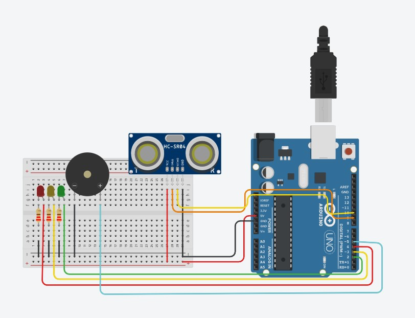
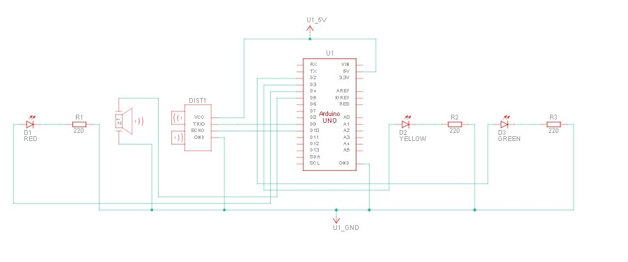
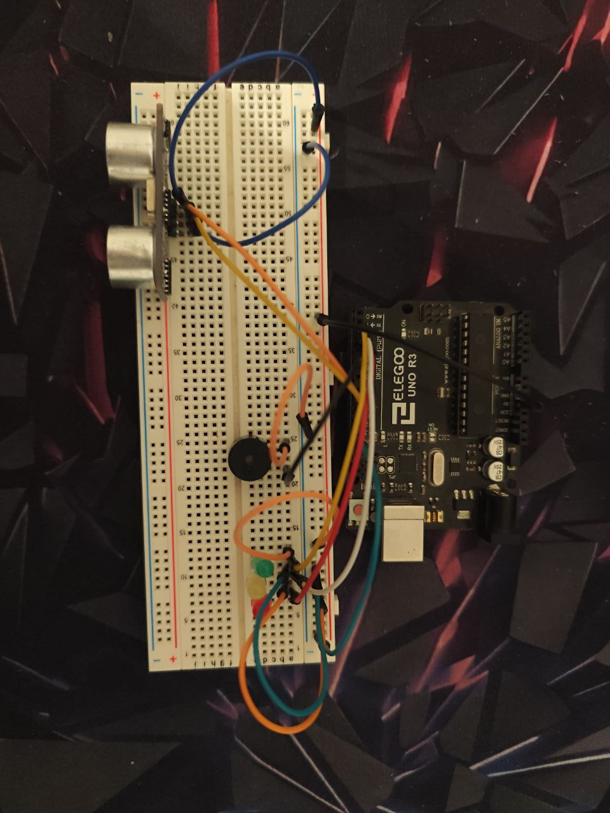

<h1 align="center" style="color: #00FF00;">>> MODULO_HW // RADAR_ULTRASUONI 📡</h1>

<p align="center">
  <i>Sistema di rilevamento prossimità a 3 stadi con feedback visivo e allarme acustico. Isolato e testato contro sovraccarichi di corrente.</i>
</p>

---

## 🔌 MAPPA DEI COLLEGAMENTI (Pinout)

Di seguito la tabella di cablaggio per replicare il nodo hardware. **Tutti i LED richiedono una resistenza di pull-down da 220 Ω** collegata al catodo per evitare la frittura del microcontrollore.

| Componente | Pin Componente | Pin Arduino (I/O) | Funzione Logica |
| :--- | :--- | :---: | :--- |
| **Sensore HC-SR04** | `VCC` / `GND` | `5V` / `GND` | Alimentazione |
| | `TRIG` | `D9` | Emissione impulso sonoro |
| | `ECHO` | `D10` | Ricezione rimbalzo sonoro |
| **LED Verde** | Anodo (+) | `D2` | Segnale: Zona Sicura (>30cm) |
| **LED Giallo** | Anodo (+) | `D3` | Segnale: Avvertimento (10-30cm) |
| **LED Rosso** | Anodo (+) | `D4` | Segnale: Pericolo Critico (<10cm) |
| **Piezo (Buzzer)** | Positivo (+) | `D5` | Allarme acustico (1000Hz) |

---

## 🖥️ FASE 1: AMBIENTE VIRTUALE (Tinkercad)

> **[ SIMULAZIONE APPROVATA ]** Il circuito è stato progettato e collaudato nel simulatore per validare la caduta di tensione, l'assorbimento di corrente e la logica di trigger senza rischiare l'hardware fisico.

### Schema di Montaggio (Breadboard)
<div align="center">
  
</div>

### Schema Elettrico di Circuito
<div align="center">
  
</div>

### Distinta Base (Componenti)
* 1x Arduino Uno R3
* 1x Breadboard (Small)
* 1x Sensore a Ultrasuoni HC-SR04
* 3x LED (Verde, Giallo, Rosso)
* 3x Resistenze da 220 Ω
* 1x Piezo (Buzzer)

---

## 💻 FASE 2: LOGICA DI CONTROLLO (Firmware C++)

Il firmware include una patch di timeout sul comando `pulseIn()` per azzerare il lag di lettura quando non ci sono ostacoli nel raggio d'azione, mantenendo il loop a ~30 FPS.

```cpp
// Estratto del Core Loop (Zero-Lag Patch)
  durata = pulseIn(echoPin, HIGH, 15000); // Timeout a 15ms
  
  if (durata == 0) {
    distanza = 100; // Nessun ostacolo rilevato
  } else {
    distanza = durata * 0.034 / 2; // Calcolo conversione in cm
  }
```
*(Il codice sorgente completo è disponibile nel file `sorgente.ino` in questa directory).*

---

## 🛠️ FASE 3: DEPLOYMENT FISICO (Hardware Reale)

> **[ ANOMALIA HARDWARE DOCUMENTATA // Bypass Resistenze ]** > Come visibile nelle foto del deployment reale, il circuito fisico è stato assemblato **senza le resistenze di pull-down sui LED**, a differenza dello schema virtuale. 
> * **Perché su Tinkercad esplode?** Il motore fisico del simulatore applica la Legge di Ohm pura: senza resistenze calcola una corrente infinita e simula la rottura.
> * **Perché nella realtà funziona?** Per test di breve durata, la resistenza interna dei pin dell'ATmega328P di Arduino limita fisicamente l'erogazione di corrente a circa 40mA. Questo evita l'esplosione istantanea dei LED, permettendo un cablaggio "rapido e sporco" (quick-and-dirty) utile per validare velocemente il prototipo, pur essendo una pratica sconsigliata per installazioni permanenti in quanto riduce la vita utile dei componenti.

> **[ TRASFERIMENTO COMPLETATO ]** Il codice e lo schema sono stati trasferiti con successo sui componenti fisici reali. Sistema stabile e reattivo.

### Circuito Assemblato
<div align="center">
  
</div>

### Dimostrazione Operativa
*(Video dimostrativo del sistema in funzione con ostacoli in avvicinamento)*
<div align="center">
  <video src="./assets/real_demo.mp4" width="90%" controls></video>
</div>

<br>

---
<div align="center">
  <a href="../README.md"></a>
</div>
